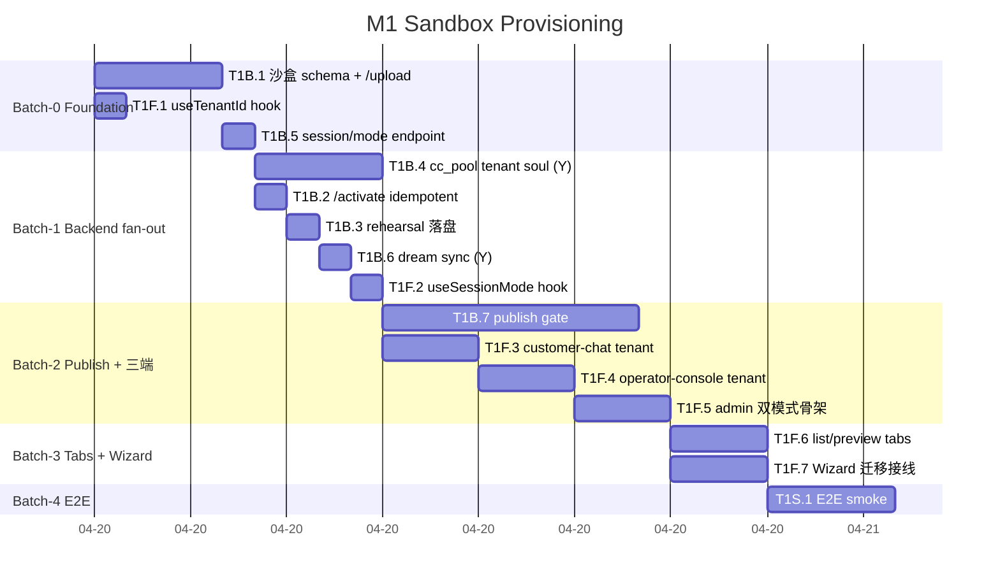
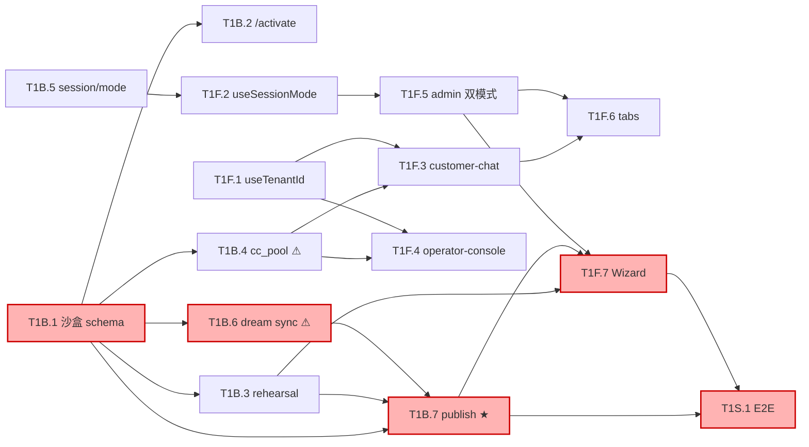

# M1 Sandbox Provisioning · Execution Plan

> Generated by `prd2impl:skill-4-plan-schedule` on 2026-04-20
>
> Source: [2026-04-20-tasks.yaml](2026-04-20-tasks.yaml) · [project.yaml](project.yaml)

## Snapshot

| | |
|---|---|
| Parallel capacity | 2（Dev1 + Claude subagents） |
| Batches | 5 |
| Critical path | `T1B.1 → T1B.6 → T1B.7 → T1F.7 → T1S.1` |
| Estimated duration | ~3 工作日（25h + 20% buffer） |
| Yellow tasks | T1B.4, T1B.6 |
| Red tasks | 0 |

## Gantt

## Dependency (critical path 红色)

★ = large task on critical path; ⚠ = yellow

---

## Batches

### Batch 0 · Foundation

| Task | Slot | h | Notes |
|---|---|---|---|
| T1B.1 | A | 4 | Backend 地基；focus |
| T1F.1 | B | 1 | 可 subagent 并行 |
| T1B.5 | A | 1 | 紧随 T1B.1 |

Gate：沙盒目录可建产物 · useTenantId 测试通过 · /api/session/mode 返回 master

### Batch 1 · Backend fan-out

| Task | Slot | h | Notes |
|---|---|---|---|
| T1B.4 ⚠ | A | 4 | cc_pool worker 生命周期风险 pre-flight |
| T1B.2 | B | 1 | |
| T1B.3 | B | 1 | |
| T1B.6 ⚠ | B | 1 | 完成后跑 T6C.3 回归 |
| T1F.2 | B | 1 | |

Gate：cc_pool tenant soul · rehearsal 持久化 · dream 落盘 · useSessionMode

### Batch 2 · Publish + 三端

| Task | Slot | h | Notes |
|---|---|---|---|
| T1B.7 ★ | A | 8 | Critical path 瓶颈 |
| T1F.3 | B | 3 | |
| T1F.4 | B | 3 | |
| T1F.5 | B | 3 | |

Gate：publish 可产 tarball + 归档 · 三端 /t/<tid>/ 可加载 · admin-portal 进 MasterLayout

### Batch 3 · Tabs + Wizard（真并行）

| Task | Slot | h | Notes |
|---|---|---|---|
| T1F.6 | A | 3 | 与 T1F.7 不冲突 |
| T1F.7 | B | 3 | Critical path |

Gate：/master/tenants 列表 · preview 嵌入 · wizard 可 publish

### Batch 4 · E2E

| Task | Slot | h | Notes |
|---|---|---|---|
| T1S.1 | A | 4 | §10 九条验收 |

Gate：M1 整体通过 · 可交付

---

## Milestone M1 Gate

1. 15 tasks 全 completed
2. `pytest tests/` 全绿
3. `make check` 通过
4. T6C.3 回归通过（/approve /reject 流不破坏）
5. §10 九条人工验收通过
6. Tarball 解压后手工 fork 仓 `make check` 通过

**Target**：Day 3 EOD · **Buffer**：+20% = Day 4 AM

---

## Execution 建议

- **Batch 0 开场**：读 design spec 最后一遍，确认 §2 / §3 目录 schema 再动手
- **T1B.4 开启前**：先用 `superpowers:receiving-code-review` subagent 对 cc_pool 现状做风险 pre-flight，避免走错设计
- **T1B.7 拆分**（如 large 超时）：`publish.py 核心` + `api_routes.py 端点接线` 两子任务
- **Batch 3 真并行**：用 `superpowers:dispatching-parallel-agents` 同时启动 T1F.6 + T1F.7
- **每 batch 结束**：跑一次 gate smoke，commit；不过 gate 不进下一 batch
