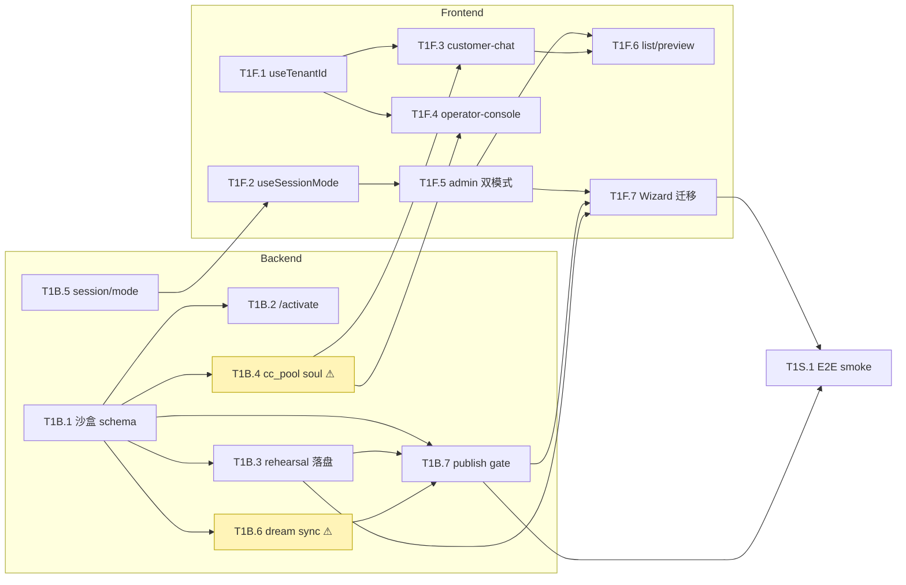

# M1 Tasks · Master-side Sandbox Provisioning

> Generated by `prd2impl:skill-3-task-gen` on 2026-04-20
>
> Source: [2026-04-20-gap-analysis.yaml](2026-04-20-gap-analysis.yaml) + [2026-04-20-task-hints.yaml](2026-04-20-task-hints.yaml)

## Summary

- **Total tasks**: 15 (P1 / M1)
- **Classification**: 13 Green · 2 Yellow · 0 Red
- **Lanes**: 7 backend · 7 frontend · 1 shared
- **Critical path**: `T1B.1 → T1B.6 → T1B.7 → T1F.7 → T1S.1` (5 tasks deep)
- **Estimated**: 2-3 days with 2 parallel lanes

---

## Tasks

### Backend lane (`autoservice/`)

| ID | Task | Type | Effort | Gap | Depends | Deliverables |
|---|---|---|---|---|---|---|
| T1B.1 | 沙盒目录 schema + /upload KB + souls 落盘 | Green | M | GAP-001 · GAP-005 | — | onboarding.py · soul_generator.py · dream_soul_template.md |
| T1B.2 | /activate 幂等 merge + channels 落盘 | Green | S | GAP-001 | T1B.1 | onboarding.py |
| T1B.3 | /rehearsal/generate 落盘 + /rehearsal/review 端点 | Green | S | — | T1B.1 | api_routes.py |
| T1B.4 | cc_pool per-tenant soul 注入 ⚠ | Yellow | M | GAP-012 | T1B.1 | cc_pool.py |
| T1B.5 | /api/session/mode endpoint (master-only) | Green | S | — | — | api_routes.py |
| T1B.6 | Dream 配置 sync 到 config.json.dream ⚠ | Yellow | S | GAP-005 | T1B.1 | api_routes.py |
| T1B.7 | Publish gate + tarball + 归档 + ForkCreator | Green | L | GAP-003 | T1B.1 · T1B.3 · T1B.6 | publish.py · api_routes.py |

### Frontend lane (`frontend/`)

| ID | Task | Type | Effort | Gap | Depends | Deliverables |
|---|---|---|---|---|---|---|
| T1F.1 | useTenantId 通用 hook | Green | S | GAP-004 | — | useTenantId.ts |
| T1F.2 | useSessionMode hook | Green | S | — | T1B.5 | useSessionMode.ts |
| T1F.3 | customer-chat 路由 + tenant 化 | Green | M | GAP-004 | T1F.1 · T1B.4 | customer-chat/App.tsx |
| T1F.4 | operator-console 路由 + tenant 化 | Green | M | GAP-004 · GAP-013 | T1F.1 · T1B.4 | operator-console/WorkspacePage.tsx |
| T1F.5 | admin-portal 双模式分发 + 布局骨架 | Green | M | — | T1F.2 | admin-portal/App.tsx · MasterLayout · TenantLayout |
| T1F.6 | 租户列表 + 代入预览 tabs | Green | M | — | T1F.5 · T1F.3 | TenantListTab · TenantPreviewTab |
| T1F.7 | WizardTab 迁移 + publish/review 接线 | Green | M | GAP-001 · GAP-003 | T1F.5 · T1B.7 · T1B.3 | wizard/WizardTab.tsx |

### Shared lane

| ID | Task | Type | Effort | Depends | Deliverables |
|---|---|---|---|---|---|
| T1S.1 | 端到端沙盒 provisioning smoke test | Green | M | T1F.7 · T1B.7 | tests/e2e/test_sandbox_provisioning.py |

⚠ = Yellow，需 code-reviewer 介入

---

## Dependency Graph (Mermaid)

---

## Coverage & Scope

### Gap 覆盖 (M1)

| Status | Count | Gap IDs |
|---|---|---|
| **M1 已覆盖** | 6 | GAP-001 · GAP-003 · GAP-004 · GAP-005 (留位) · GAP-012 (soul 级) · GAP-013 (顺带) |
| **M2 推迟（P0）** | 2 | GAP-002 · GAP-006 |
| **M2 推迟（P1）** | 5 | GAP-007 · GAP-008 · GAP-009 · GAP-010 · GAP-011 |
| **M2 推迟（P2）** | 5 | GAP-014 · GAP-015 · GAP-016 · GAP-017 · GAP-018 |

### 设计驱动任务（无 gap 背书）

- **T1B.5**：`/api/session/mode` endpoint
- **T1F.2**：useSessionMode hook
- **T1F.5**：MasterLayout / TenantLayout 双模式布局
- **T1F.6**：租户列表 / 代入预览 tabs

这 4 个任务源自 brainstorming 阶段"Master/Tenant 双部署"设计决策，gap 文档写于该决策前。

---

## M1 Gate（§10 验收）

1. `/master/tenants` 空租户列表
2. 向导完整 Step 0~4
3. 沙盒产物齐全（souls/kb/rehearsal/config）
4. `/t/<tid>/chat` 可对话 + WS 日志含 tenant_id
5. 多租户隔离（两个沙盒并发，soul 不串）
6. 代入预览（iframe 嵌入）
7. Dream 配置落盘
8. Publish 完整产物（tarball + runbook + archive + 410）
9. Fork 手工验证（tarball → fork 仓 `make check` 通过）

---

## Warnings

- ⚠️ **T1B.4** 有 cc_pool worker 生命周期风险 — code-reviewer 提前核实
- ⚠️ **T1B.6** 改动 dream_config_dialog 边界 — T6C.3 回归需同时跑
- ⏱️ **T1B.7** 是 critical path 上的 large 任务 — 早启动
- 📊 lane 平衡良好（backend 7 + frontend 7 + shared 1）
