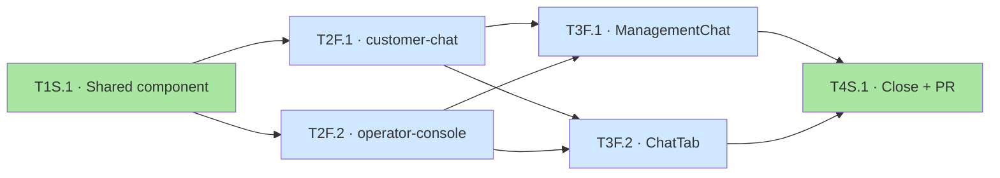

# Chat Markdown Feature — Task List

**Generated**: 2026-04-21 · **Source**: [prd-structure.yaml](2026-04-21-prd-structure.yaml) + [task-hints.yaml](2026-04-21-task-hints.yaml)
**Total**: 6 tasks across 4 phases · **Type**: 6 Green / 0 Yellow / 0 Red · **Line**: 2 shared / 4 frontend · **Critical path**: 4

## Phase 1 — Shared component

| ID | 名称 | 类型 | 工作量 | 依赖 |
|----|------|------|--------|------|
| T1S.1 | Shared MarkdownMessage component + CSS + 10 unit tests | green | medium | — |

**Gate**：MarkdownMessage 10/10 单测全绿；4 条安全不变量（raw-HTML-escaped / `<a>` 硬化 / `` 剥离 / `javascript:` 过滤）有测试 pin。

## Phase 2 — customer-chat + operator-console（并行）

| ID | 名称 | 类型 | 工作量 | 依赖 |
|----|------|------|--------|------|
| T2F.1 | customer-chat MessageBubble integration | green | small | T1S.1 |
| T2F.2 | operator-console CopilotView integration (4 render sites; ConversationFeed skipped) | green | small | T1S.1 |

**Gate**：两个 agent 面渲染 markdown；user 面 plain；每面 2 回归 case 绿；无 M1 回归。
**并行**：✓（不同 app、不同文件）

## Phase 3 — admin-portal（并行）

| ID | 名称 | 类型 | 工作量 | 依赖 |
|----|------|------|--------|------|
| T3F.1 | admin-portal ManagementChat integration | green | small | T2F.1, T2F.2 |
| T3F.2 | admin-portal ChatTab integration | green | small | T2F.1, T2F.2 |

**Gate**：ManagementChat（dream_engine）+ ChatTab（assistant）都渲染 markdown；每面 2 回归 case。
**并行**：✓（同 app 不同文件；测试互不干扰）

## Phase 4 — Close + PR

| ID | 名称 | 类型 | 工作量 | 依赖 |
|----|------|------|--------|------|
| T4S.1 | Focused regression + 3 artifacts + PR | green | small | T3F.1, T3F.2 |

**Gate**：focused vitest subset 全绿；3 artifacts 注册+链接；PR 提起至 dev。

## 依赖图

关键路径（4 深）：**T1S.1 → T2F.1 → T3F.1 → T4S.1**

## 警告

- 无 `gap-analysis.yaml` → 全部 `gap_ref: null`（沿用 M2 先例，skill-3 兼容）
- `task_hints.file_changes` 的 `related_gap_refs` 全空 → Behavior 1 触发 fallback，改由 `implementation_steps.touches_files` 的文件归属决定 task 分组
- 依赖链沿用 task-hints 作者意图（T3F.* → T2F.*）— 实际文件独立，但保留保守链；`/plan-schedule` 可宣告 P3 独立于 P2 并行
- P2 + P3 都标了 `parallel_safe: true`
- Non_goals 检查：6 项非目标 token 均未出现在 deliverable 路径中 → 无 task 被拒

## 下一步

1. **Human review**（推荐你扫一眼 [tasks.yaml](2026-04-21-tasks.yaml)）：
   - 颗粒：T1S.1 medium（包 deps + component + css + 10 tests），是否要拆？
   - 颜色：6 Green 全对？T1S.1 的安全不变量是否 yellow-worthy？（spec + plan 都判 green）
   - 依赖：保守链（T3F → T2F）可接受还是压平？
2. **确认后**：`/plan-schedule --plans-dir docs/plans/feat-chat-markdown` → execution-plan.yaml + batch-kickoff
3. **再**：`/autorun green --plans-dir docs/plans/feat-chat-markdown`（6 task 全 Green，autorun 直达）
