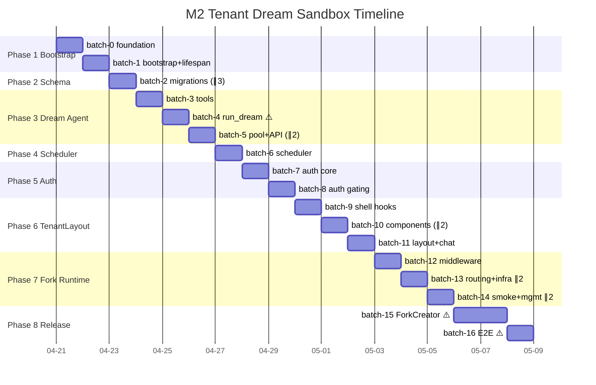

# M2 执行计划 — Tenant-side Dream Sandbox

**生成日期**：2026-04-20 · **来源**：[tasks.yaml](2026-04-20-tasks.yaml) · **并行容量**：2（Dev1 + Claude 子代理）
**总任务**：38 · **Batch 数**：17 · **估算工期**：6–7 工作日（~54h）

> 通过在 Phase 内按文件耦合聚合，将 plan 声明的 38 深线性链压成 17 个 batch；其中 5 个 batch 可并行分派子代理。

## Batch 概览

| Batch | 阶段 | 名称 | 任务 | 并行 | 时长 |
|-------|------|------|------|------|------|
| batch-0 | P1 | Bootstrap foundation | T1B.1 → T1B.2 | 串行 | 4h |
| batch-1 | P1 | Tenant bootstrap + lifespan | T1B.3 → T1B.4 → T1B.5 | 串行 | 3h |
| batch-2 | P2 | **Schema migrations** | T2B.1 ∥ T2B.2 ∥ T2B.3 | **3 并行** | 2h |
| batch-3 | P3 | Dream agent tool trio | T3B.1 → T3B.2 → T3B.3 | 串行（同文件）| 3h |
| batch-4 | P3 | run_dream core loop ⚠️ | T3B.4 | 串行（large, yellow）| 8h |
| batch-5 | P3 | **Dream pool + API** | T3B.5 ∥ T3B.6 | **2 并行** | 3h |
| batch-6 | P4 | DreamScheduler | T4B.1 → T4B.2 → T4B.3 | 串行 | 5h |
| batch-7 | P5 | Auth 基础（schema + 令牌流）| T5B.1 → T5B.2 → T5B.3 → T5B.4 | 串行 | 4h |
| batch-8 | P5 | Auth 网关 + session 扩展 | T5B.5 → T5B.6 | 串行 | 3h |
| batch-9 | P6 | 前端 shell hooks | T6F.1 → T6F.2 | 串行 | 3h |
| batch-10 | P6 | **Shell 组件** | T6F.3 ∥ T6F.4 | **2 并行** | 2h |
| batch-11 | P6 | TenantLayout + ChatTab | T6F.5 → T6F.6 | 串行 | 4h |
| batch-12 | P7 | 中间件 + helper | T7B.1 → T7B.2 | 串行 | 3h |
| batch-13 | P7 | **前端路由 + 基建** | T7F.3 ∥ T7S.4 | **2 并行** | 2h |
| batch-14 | P7 | **Smoke + 管理聊天** | T7S.5 ∥ T7B.6 | **2 并行** | 1h |
| batch-15 | P8 | ForkCreator 自动化 ⚠️ | T8B.1 → T8B.2 | 串行（large, yellow）| 9h |
| batch-16 | P8 | M2 验收 E2E ⚠️ | T8S.3 | 串行（large, yellow, 手动）| 6h |

## Gantt 时间线

## 依赖关键路径（压缩后）

- 🟡 **Yellow（需人工 review）**：batch-4 / batch-15 / batch-16
- 🟢 **并行 dispatch**：batch-2 / batch-5 / batch-10 / batch-13 / batch-14

## 并行分派机会（`superpowers:dispatching-parallel-agents`）

| Batch | 并行任务 | 文件独立性 |
|-------|---------|-----------|
| batch-2 | T2B.1 ∥ T2B.2 ∥ T2B.3 | proposal_pipeline.py / memory_pool.py / dream_runs.py |
| batch-5 | T3B.5 ∥ T3B.6 | cc_pool.py / api_routes.py |
| batch-10 | T6F.3 ∥ T6F.4 | AdminRail.tsx / AdminTopbar.tsx+AvatarMenu.tsx |
| batch-13 | T7F.3 ∥ T7S.4 | frontend main.tsx / scripts/setup.sh + Makefile |
| batch-14 | T7S.5 ∥ T7B.6 | tests/fork_runtime/ / api_routes.py |

## M2 闸门

- 38 任务全部在 `task-status.md` 标记 done
- `pytest tests/`（排除 `-m e2e`）全绿
- `pytest -m e2e tests/e2e/test_m2_acceptance.py` spec §8 验收 8/8 通过
- admin-portal build 通过；vitest --run 全绿
- `scripts/setup.sh` 在 master 和 tenant 全新检出均通过
- 无 uncommitted 改动；conventional commits 日志干净

## 警告

- **Phase 5 瓶颈**：6 个任务串行在 `auth.py` + `api_routes.py`，无法并行
- **Phase 8 不确定性高**：15h 工作量集中在 2 个 large yellow 任务（gh CLI + E2E），单独预留 1 天
- **T3B.4（run_dream core）**是关键路径上的 yellow large，建议 Day 3 上午早开始，避免下午打断
- **T8S.3 E2E** 依赖 Anthropic key + gh CLI + uvicorn，需手动运行，不入 CI

## 下一步

- `/next-task` — 查看第一个可执行任务（T1B.1）
- `/batch-dispatch batch-0` — 启动首 batch
- `/autorun green|yellow|all` — 全托管自动推进

相关文件（M1 版本可复用，覆盖 M2）：
- [prompt 模板](../cc-prompt-templates.md)
- [协作 playbook](../collaboration-playbook.md)
