# M2 Task List — Tenant-side Dream Sandbox

**Generated**: 2026-04-20 · **Source**: `docs/plans/m2/2026-04-20-m2-prd-structure.yaml` + `docs/plans/m2/2026-04-20-m2-task-hints.yaml`
**Total tasks**: 38 across 8 phases · **Type split**: 31 Green / 7 Yellow / 0 Red · **Line split**: 24 backend / 7 frontend / 3 shared

> ⚠️ No `gap-analysis.yaml` exists for M2 (ingestion fed spec+plan only). Tasks are sourced from
> `task_hints.implementation_steps`; `gap_ref` is null throughout. Dependency chain preserved
> verbatim from plan (38-deep linear); `skill-4 /plan-schedule` can collapse to shorter critical path.

## Phase 1 — Bootstrap + _master seed

| ID | Name | Line | Type | Effort | Depends |
|----|------|------|------|--------|---------|
| T1B.1 | config.local.yaml schema expectations | backend | green | small | — |
| T1B.2 | soul_generator 5 roles (add dream) | backend | **yellow** | medium | T1B.1 |
| T1B.3 | ensure_master_tenant() bootstrap | backend | green | medium | T1B.2 |
| T1B.4 | ensure_local_admin() fork-side bootstrap | backend | green | small | T1B.3 |
| T1B.5 | web_gateway lifespan mode-aware startup | backend | green | small | T1B.4 |

**Gate**: Master + tenant boot hooks active; 5-role souls generated for _master and _local_admin.

## Phase 2 — Schema migrations

| ID | Name | Line | Type | Effort | Depends |
|----|------|------|------|--------|---------|
| T2B.1 | proposals.tenant_id migration | backend | green | small | T1B.5 |
| T2B.2 | memory_pool.tenant_id migration + API | backend | green | small | T2B.1 |
| T2B.3 | dream_runs.db schema + repository | backend | green | small | T2B.2 |

**Gate**: schemas live; M1 data intact.

## Phase 3 — Dream Agent

| ID | Name | Line | Type | Effort | Depends |
|----|------|------|------|--------|---------|
| T3B.1 | emit_proposal tool | backend | green | small | T2B.3 |
| T3B.2 | kb_search tool | backend | green | small | T3B.1 |
| T3B.3 | list_souls tool | backend | green | small | T3B.2 |
| T3B.4 | run_dream() agent loop (core) | backend | **yellow** | large | T3B.3 |
| T3B.5 | cc_pool role='dream' support | backend | **yellow** | medium | T3B.4 |
| T3B.6 | /api/dream/trigger + /api/dream/runs | backend | green | small | T3B.5 |

**Gate**: run_dream produces draft proposal; dream_runs row persisted; cc_pool isolation verified.

## Phase 4 — DreamScheduler

| ID | Name | Line | Type | Effort | Depends |
|----|------|------|------|--------|---------|
| T4B.1 | should_trigger() logic | backend | **yellow** | medium | T3B.6 |
| T4B.2 | scheduler loop + active-tenant discovery | backend | green | medium | T4B.1 |
| T4B.3 | /dream-config → scheduler.refresh() | backend | green | small | T4B.2 |

**Gate**: Idle tenant auto-triggers run_dream; dynamic reconfig works.

## Phase 5 — Magic-link auth

| ID | Name | Line | Type | Effort | Depends |
|----|------|------|------|--------|---------|
| T5B.1 | auth DB schema + repo | backend | green | small | T4B.3 |
| T5B.2 | POST /api/auth/request-login | backend | green | small | T5B.1 |
| T5B.3 | GET /api/auth/verify → cookie + redirect | backend | green | small | T5B.2 |
| T5B.4 | POST /api/auth/logout | backend | green | small | T5B.3 |
| T5B.5 | require_tenant_access middleware | backend | green | medium | T5B.4 |
| T5B.6 | /api/session/mode auth-state extension | backend | green | small | T5B.5 |

**Gate**: request → verify → session cookie → cross-tenant denial; logout revokes.

## Phase 6 — admin-portal TenantLayout

| ID | Name | Line | Type | Effort | Depends |
|----|------|------|------|--------|---------|
| T6F.1 | useSessionMode + useTenantId real impl | frontend | green | small | T5B.6 |
| T6F.2 | AuthGate + LoginPage | frontend | green | medium | T6F.1 |
| T6F.3 | AdminRail variant prop | frontend | green | small | T6F.2 |
| T6F.4 | AdminTopbar + AvatarMenu extensions | frontend | green | small | T6F.3 |
| T6F.5 | TenantLayout 4-tab component | frontend | green | medium | T6F.4 |
| T6F.6 | ChatTab → /api/admin/chat | frontend | green | medium | T6F.5 |

**Gate**: Tenant brand renders 4 tabs; AuthGate gates anon; ChatTab hits /api/admin/chat.

## Phase 7 — Fork runtime

| ID | Name | Line | Type | Effort | Depends |
|----|------|------|------|--------|---------|
| T7B.1 | TenantContext middleware mode branching | backend | green | medium | T6F.6 |
| T7B.2 | tenant_root() path helper | backend | green | small | T7B.1 |
| T7F.3 | customer-chat + operator-console mode routing | frontend | green | small | T7B.2 |
| T7S.4 | scripts/setup.sh mode-aware | shared | green | medium | T7F.3 |
| T7S.5 | Fork-mode boot smoke test | shared | green | small | T7S.4 |
| T7B.6 | /api/management/chat → _master routing | backend | green | small | T7S.5 |

**Gate**: Fresh tenant fork boots; customer-chat + operator-console route correctly; /api/management/chat → _master.

## Phase 8 — ForkCreator + E2E

| ID | Name | Line | Type | Effort | Depends |
|----|------|------|------|--------|---------|
| T8B.1 | GitHubApiForkCreator (gh CLI) | backend | **yellow** | large | T7B.6 |
| T8B.2 | LocalTarballForkCreator runbook config step | backend | green | small | T8B.1 |
| T8S.3 | Full E2E acceptance (@pytest.mark.e2e) | shared | **yellow** | large | T8B.2 |

**Gate**: spec §8 acceptance 8/8 pass.

## Dependency Graph (Mermaid)

```mermaid
graph LR
  subgraph P1[Phase 1 — Bootstrap]
    T1B.1 --> T1B.2 --> T1B.3 --> T1B.4 --> T1B.5
  end
  subgraph P2[Phase 2 — Schema]
    T2B.1 --> T2B.2 --> T2B.3
  end
  subgraph P3[Phase 3 — Dream Agent]
    T3B.1 --> T3B.2 --> T3B.3 --> T3B.4 --> T3B.5 --> T3B.6
  end
  subgraph P4[Phase 4 — Scheduler]
    T4B.1 --> T4B.2 --> T4B.3
  end
  subgraph P5[Phase 5 — Auth]
    T5B.1 --> T5B.2 --> T5B.3 --> T5B.4 --> T5B.5 --> T5B.6
  end
  subgraph P6[Phase 6 — TenantLayout]
    T6F.1 --> T6F.2 --> T6F.3 --> T6F.4 --> T6F.5 --> T6F.6
  end
  subgraph P7[Phase 7 — Fork Runtime]
    T7B.1 --> T7B.2 --> T7F.3 --> T7S.4 --> T7S.5 --> T7B.6
  end
  subgraph P8[Phase 8 — E2E]
    T8B.1 --> T8B.2 --> T8S.3
  end
  T1B.5 --> T2B.1
  T2B.3 --> T3B.1
  T3B.6 --> T4B.1
  T4B.3 --> T5B.1
  T5B.6 --> T6F.1
  T6F.6 --> T7B.1
  T7B.6 --> T8B.1
```

## Warnings

- **No gap-analysis.yaml** — all `gap_ref` are null.
- **Linear dep chain (38-deep)** — plan authored tasks as a sequence. Within phases, real coupling is looser: e.g. T3B.1/2/3 (three dream tools) are independent and only join at T3B.4 (run_dream). `/plan-schedule` can identify intra-phase parallelism.
- **7 Yellow tasks** cluster on LLM content (T1B.2 dream soul template), agent strategy (T3B.4 run_dream, T4B.1 should_trigger), pool isolation (T3B.5), and external integration (T8B.1 gh CLI, T8S.3 live-LLM E2E). Plan human-review checkpoints.
- **3 Large-effort tasks** (T3B.4, T8B.1, T8S.3) — consider splitting during `/start-task` if granularity slips.
- **Non-goals filter** applied: no deliverable matched the 13 non_goals tokens (subtenant, OAuth, SSO, auto-apply, cross-tenant, etc.).

## Next Step

Run `/plan-schedule` to generate `execution-plan.yaml` with batch grouping, parallel-capacity assignment, and milestone timeline.
