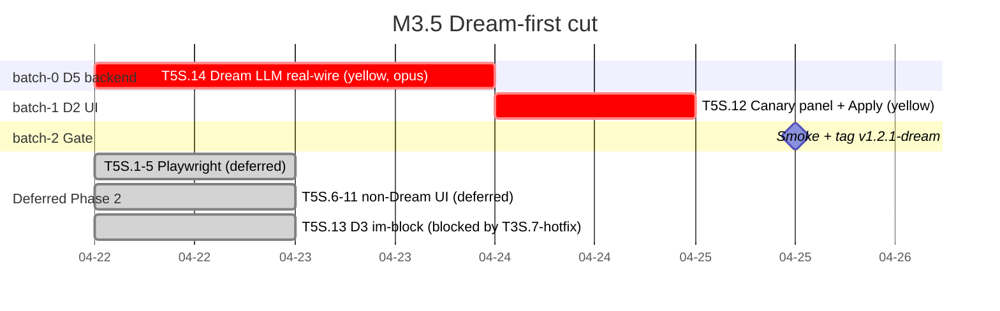
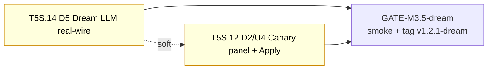

# M3.5 Execution Plan · Dream-first cut (LLM real-wire + canary UI)

> **Revised 2026-04-22** — User pivot: focus M3.5 on Dream engine only. Playwright suites + non-Dream UI moved to deferred Phase 2 (kept on disk for later re-activation).
> **Target**: 2026-04-24 EOD (3 days) · **Tag**: `v1.2.1-dream`
> **Tasks**: [2026-04-22-tasks.yaml](2026-04-22-tasks.yaml) · **Plan**: [2026-04-22-execution-plan.yaml](2026-04-22-execution-plan.yaml)
> **Prompt templates**: [docs/plans/cc-prompt-templates.md](../cc-prompt-templates.md)
> **Playbook**: [docs/plans/collaboration-playbook.md](../collaboration-playbook.md)

## Summary at a glance

- **Active**: 3 batches · 2 tasks (T5S.14 D5, T5S.12 D2/U4) — both 🟡 Yellow
- **Deferred to Phase 2**: T5S.1-5 Playwright + T5S.6/7/8/10/11 non-Dream UI (9 tasks)
- **Still blocked**: T5S.13 D3 (external T3S.7-hotfix)
- **Estimated active**: ~13-18h human · ~3-4h AI · 3 calendar days
- **Critical path**: `T5S.14 → T5S.12` (~12-16h)

## Gantt (active scope)



## Dependency graph (active scope)



`T5S.14 -.soft.-> T5S.12` — not a hard dep. D2 pulls from already-shipped M3 APIs (`/api/canary/*` + `/api/admin/proposals/{id}/apply`). Sequenced D5 → D2 so the canary UI exercises real LLM-generated proposals (not `DREAM_DEV_STUB` seeds). Can be parallelised if you want to compress calendar.

## Batch roster

### batch-0 · D5 Dream LLM real-wire (Day 1 — 2026-04-22)
_Isolated yellow backend._ 8-12h human / ~2-3h AI.

| Task | Mode | Est | Notes |
|---|---|---|---|
| T5S.14 🟡 D5 Dream LLM real-wire | solo-opus | 8-12h + review | T3B.5 cc_pool tool-use + T4S.4b per-tenant + master loop |

**Scope breakdown** (from [mini-sprint §1.4](../m3.5-mini-sprint.md#14-dream-engine-llm-real-wire-backend--promoted-2026-04-22)):
1. `cc_pool.client.call_with_tools(system, messages, tools) -> Message` — thin Anthropic SDK wrapper bound to Dream role clients
2. Remove `RuntimeError` guard in [dream_agent.py:1117-1134](../../../autoservice/dream_agent.py#L1117-L1134); build default `llm_send` closure
3. [master_dream_agent.py:102-121](../../../autoservice/master_dream_agent.py#L102-L121) → real `_run_agent_loop` over `gather_platform_signals` output
4. `api_routes._run_and_mark` → drop `DREAM_DEV_STUB` from default path; keep env gate for offline dev
5. Tests: VCR unit + `@pytest.mark.live` opt-in + regression green

**Gate**:
- cinnox trigger w/o `DREAM_DEV_STUB` → `status=completed`, `tokens_in>0`, `tokens_out>0`, proposal.title NOT `[dev stub]`
- `_master` `run_platform_dream` → LLM-backed (non-zero tokens, non-templated)
- `pytest tests/dream_agent tests/dream_runs tests/dream tests/api/test_dream_api.py tests/cc_pool` fully green
- **code-reviewer APPROVED** — CON-04 5-layer defence intact (signature lock, `'draft'` hardcode, import cone, AST guardrail T4S.8)

**Kickoff**: [batch-0-kickoff.md](batch-0-kickoff.md)

### batch-1 · D2 Canary panel + 3-button Apply (Day 2 — 2026-04-23)
_Yellow UI consolidation._ 4h human / ~1h AI + review.

| Task | Mode | Est | Notes |
|---|---|---|---|
| T5S.12 🟡 D2/U4 Canary panel | solo-yellow | 4h + review | Consolidates M3's minimal DreamTab Apply button (commit `2e50ac1`) into a full canary panel |

**Gate**:
- vitest canary-panel + metric-compare green
- Manual walkthrough: 5% → 25% → 100% advance + rollback at each stage + Apply button enabled only when `proposal.status == 'accepted'`
- **code-reviewer APPROVED** — Apply button does NOT bypass `/api/admin/proposals/{id}/apply`; old minimal Apply button removed from DreamTab (single source of truth)

**Kickoff**: [batch-1-kickoff.md](batch-1-kickoff.md)

### batch-2 · M3.5 Dream-first gate (Day 3 — 2026-04-24)
_Smoke + regression + tag._ 1-2h human / ~30min AI.

| Step | Est | Notes |
|---|---|---|
| `/prd2impl:skill-10-smoke-test M3.5` (Dream scope) | 30min | `.artifacts/milestones/m3.5/smoke-report.md` — Playwright checks explicitly skipped |
| M2 + M3 base + Dream regression | 20min | pytest only; no Playwright |
| Tag `v1.2.1-dream` on dev-a | 5min | `git tag v1.2.1-dream && git push --tags` |
| Open PR dev-a → dev | 15min | Body enumerates deferred tasks + links smoke report |

**Gate**: smoke GO + regression green + tag pushed + PR opened.

**Kickoff**: [batch-2-kickoff.md](batch-2-kickoff.md)

## Deferred — Phase 2 mini-sprint (kept on disk)

These stay in [docs/plans/m3.5/2026-04-22-tasks.yaml](2026-04-22-tasks.yaml) for later re-activation. Do NOT delete the files.

| Task | Alias | Why deferred |
|---|---|---|
| T5S.1 | — | Playwright scaffold — user pivot 2026-04-22 |
| T5S.2 | — | Playwright Epic1 Onboarding |
| T5S.3 | — | Playwright Epic2 Realtime-chat |
| T5S.4 | — | Playwright Epic3 Dashboards |
| T5S.5 | — | Playwright Epic4 Dream-learning (will re-activate with T5S.12 downstream) |
| T5S.6 | U1 | Operator login page |
| T5S.7 | U2 | Admin Team page |
| T5S.8 | U3 | Classify-intent keyword editor |
| T5S.10 | U5 | SLA alert toast + banner |
| T5S.11 | U6 | Admin-invite landing |
| T5S.13 | D3 | Im-block renderer — stays blocked on T3S.7-hotfix |

Re-activation plan: after `v1.2.1-dream` ships, run:
```
/prd2impl:skill-4-plan-schedule --plans-dir docs/plans/m3.5 --scope playwright-ui
```
(or hand-edit this file to restore the Phase-2 batches.)

## Review checklist (Step 9 STOP)

1. **D5 / D2 sequencing** — plan runs D5 → D2 so the canary UI exercises real proposals. If you want to parallelise (shave ~4h calendar), dispatch both batches in parallel; D2 just uses `DREAM_DEV_STUB` seed data during dev until D5 lands.
2. **D5 live test cost** — `pytest -m live` is opt-in; budget ~$1-2 Anthropic API for the D5 close-out live run.
3. **Tag naming** — `v1.2.1-dream` signals the Dream-first cut. If you'd rather keep `v1.2.1-ui` for when UI also ships, use `v1.2.1-dream-rc` or similar here.
4. **PR body** — batch-2 opens `dev-a → dev`. Body must enumerate deferred tasks so reviewers don't mistake the scope for "M3.5 complete".

When ready:
- **Kick off D5**: `/prd2impl:skill-5-start-task T5S.14` or `/prd2impl:skill-8-batch-dispatch batch-0`
- **Autopilot through Dream only**: `/prd2impl:skill-13-autorun --scope dream`
