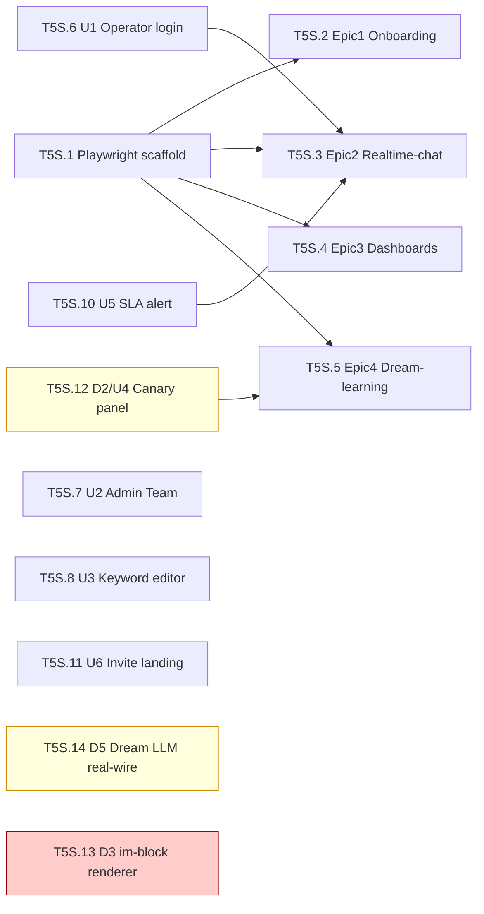

# M3.5 Mini-Sprint · Task Breakdown

> **Source**: [docs/plans/m3.5-mini-sprint.md](../m3.5-mini-sprint.md) (direct, no `/ingest-docs` run)
> **YAML**: [2026-04-22-tasks.yaml](2026-04-22-tasks.yaml)
> **Plans dir**: `docs/plans/m3.5` (per [project.yaml](../project.yaml))
> **Target tag**: `v1.2.1-ui`
> **Generated**: 2026-04-22

## Tasks

| ID | Alias | Name | Type | Effort | Status | Depends on | Blocked by |
|---|---|---|---|---|---|---|---|
| T5S.1 | — | Playwright scaffold + config + CI | 🟢 green | medium | pending | — | — |
| T5S.2 | — | Playwright Epic1 Onboarding (US-1.1-1.4) | 🟢 green | medium | pending | T5S.1 | — |
| T5S.3 | — | Playwright Epic2 Realtime-chat (US-2.1-2.6) | 🟢 green | large | pending | T5S.1, T5S.6, T5S.10 | — |
| T5S.4 | — | Playwright Epic3 Dashboards (US-3.1-3.3) | 🟢 green | medium | pending | T5S.1 | — |
| T5S.5 | — | Playwright Epic4 Dream-learning (US-4.1-4.4) | 🟢 green | medium | pending | T5S.1, T5S.12 | — |
| T5S.6 | U1 | Operator login page + session mgmt | 🟢 green | small | pending | — | — |
| T5S.7 | U2 | Admin Portal Team page | 🟢 green | medium | pending | — | — |
| T5S.8 | U3 | Classify-intent keyword editor | 🟢 green | small | pending | — | — |
| T5S.10 | U5 | SLA alert toast + banner | 🟢 green | small | pending | — | — |
| T5S.11 | U6 | Admin-invite landing page | 🟢 green | small | pending | — | — |
| T5S.12 | D2/U4 | Canary panel w/ 3-button pattern | 🟡 yellow | medium | pending | — | — |
| T5S.13 | D3 | Im-block renderer (param / proposal-summary / metric-compare) | 🟢 green | medium | **blocked** | — | T3S.7-hotfix |
| T5S.14 | D5 | Dream LLM real-wire (T3B.5 + T4S.4b) | 🟡 yellow | large | pending | — | — |

**States legend**: pending / in-progress / spec-review / quality-review / done / blocked

## Shipped ahead of M3.5 (during M3 batch-10.5)

Listed for auditor traceability — not re-implemented.

| Alias | Name | Commit | Landed in |
|---|---|---|---|
| D1 | Dream status band | `2e50ac1` | DreamTab.tsx status card |
| D4 | Dream runs history (inline) | `2e50ac1` | DreamTab.tsx 最近运行 table |

## Dependency graph

**Critical path**: T5S.6 → T5S.3 (2 hops; U1 login unlocks the longest Playwright suite).
**Alt path**: T5S.12 → T5S.5 (Dream canary panel → Epic4 suite; parallelizable).

## Summary

- **Total tasks**: 13 (11 Green / 2 Yellow / 0 Red)
- **Status**: 12 pending / 1 blocked
- **Effort mix**: 4 small / 7 medium / 2 large
- **Estimated duration**: ~48-62h human / ~12-17h AI (per mini-sprint §3)
- **Critical path**: 2 tasks deep

## Yellow-flag tasks (require code-reviewer subagent)

| Task | Why yellow | Reviewer focus |
|---|---|---|
| **T5S.12** D2/U4 canary panel | UX decisions on 3-button merge + Apply button data-flow | CON-04: Apply never mutates proposal.status outside `/api/admin/proposals/{id}/apply` |
| **T5S.14** D5 Dream LLM real-wire | Touches dream proposal write path + cc_pool surface expansion | CON-04 red-line (emit_proposal signature unchanged, hardcoded `'draft'`), DREAM_DEV_STUB env gate retained |

## Warnings

| # | Severity | Note |
|---|---|---|
| W1 | info | D1 + D4 already shipped in M3 (commit 2e50ac1) — listed under `shipped_in_m3`, not re-implemented |
| W2 | warn | T5S.13 (D3) blocked_by external T3S.7-hotfix (itself deferred after A2 revert). Does not block M3.5 gate per §4 |
| W3 | warn | T5S.3 (Epic2) estimated large 6-8h; US-2.1 3s greeting + role-flip are race-debug hotspots. Consider split if overrun |
| W4 | yellow | T5S.14 (D5) requires code-reviewer — matches M3 CON-04 protection pattern (T2S.1/T2S.4/T2S.5/T2S.8) |
| W5 | yellow | T5S.12 (D2/U4) reviewer must verify Apply button does not bypass `/api/admin/proposals/{id}/apply` |
| W6 | info | No `/ingest-docs` run preceded this task-gen — downstream retro / contract-check skills should honor `traceability: sprint-doc-direct` |
| W7 | info | No connector-seam integration tasks added — Playwright suites already cover E2E, D5's VCR + live harness covers its producer-consumer seam |

## Review checklist (Step 8 STOP)

Before running `/prd2impl:skill-4-plan-schedule`:

1. **Task granularity** — T5S.3 (large, 6-8h) is the only candidate for split; leave unless you want a second Playwright dispatcher.
2. **Color classification** — T5S.8 (U3 keyword editor) is green per sprint doc; if you'd rather treat keyword-curation copy as domain judgement, upgrade to yellow.
3. **Dependencies** — T5S.5 depends on T5S.12 (D2 Apply button) to exercise US-4.4 canary rollback; T5S.14 (D5) is intentionally independent (mocks suffice for Playwright).
4. **Phase grouping** — single phase P5 matches mini-sprint §3. If you want to parallelise U1/U2/U3 as a "foundation wave", let skill-4 do that.

When ready: `/prd2impl:skill-4-plan-schedule --plans-dir docs/plans/m3.5`.
