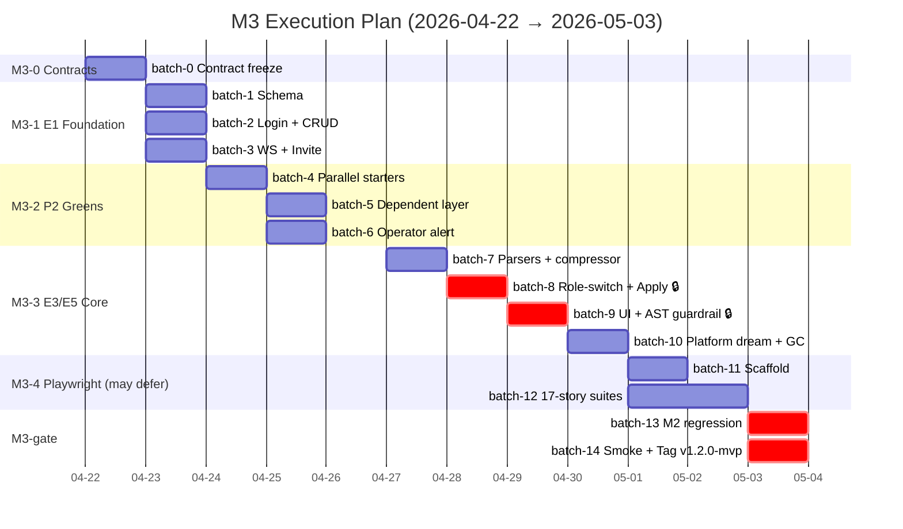

# M3 Execution Plan · Human-Readable View

**Generated**: 2026-04-21 · [prd2impl:skill-4-plan-schedule]
**Authoritative source**: [execution-plan.yaml](execution-plan.yaml)
**Kickoff**: 2026-04-22 · **Target gate**: 2026-05-03 (11 days) · M3.5 fallback: 2026-05-01 (9 days)

---

## At-a-Glance

| Metric | Value |
|---|---|
| Batches | **15** (batch-0 → batch-14) |
| Milestones | 6 (M3-0 → M3-gate) |
| Tasks | 39 (0 Red · 13 Yellow · 26 Green) |
| Critical path | 8 tasks / ~35 hrs |
| Serial estimate | 11.5 days |
| With subagent parallelism | **9-11 days** |
| Buffer (+20%) | 11 days target → 13 days hard stop |
| Dev1 solo line | + parallel_capacity=2 subagents |

**PRD §4.3 original estimate**: 2026-05-07. This plan tracks **4 days ahead** via Epic E2 descope + parallel subagent fan-out.

---

## Gantt Timeline



---

## Batch Summary Table

| # | Name | Milestone | Start | Dur | Tasks | Risks |
|---|---|---|---|---|---|---|
| **batch-0** | Contract Freeze | M3-0 | 04-22 AM | 4h | T0S.1–T0S.4 | — |
| **batch-1** | E1 Schema | M3-1 | 04-22 PM | 3h | T1S.1 | — |
| **batch-2** | E1 Login + CRUD | M3-1 | 04-23 AM | 6h | T1S.2, T1S.4 | — |
| **batch-3** | E1 WS + Invite | M3-1 | 04-23 PM | 6h | T1S.3🟡, T1S.5 | WS security |
| **batch-4** | P2 Starters | M3-2 | 04-24 AM | 8h | T2S.1🟡, T2S.3, T2S.6, T2S.8🟡 | RBAC P95 budget |
| **batch-5** | P2 Dependent | M3-2 | 04-25 AM | 6h | T2S.2, T2S.4, T2S.7 | — |
| **batch-6** | Operator Alert | M3-2 | 04-25 PM | 3h | T2S.5🟡 | — |
| **batch-7** | P3/P4 Preps | M3-3 | 04-27 AM | 8h | T3S.1🟡, T3S.3, T4S.7🟡 | T4S.7 pulled fwd |
| **batch-8** | 🔒 Core: Role-Switch + Apply | M3-3 | 04-28 AM | 10h | T3S.2🟡, T3S.4, **T4S.1🔒**, T4S.2 | **CON-04 red line** |
| **batch-9** | Close: UI + AST | M3-3 | 04-29 AM | 8h | T3S.5, T3S.6, T4S.3🟡, **T4S.8🔒** | AST guardrail lock |
| **batch-10** | P4 Remainders | M3-3 | 04-30 AM | 6h | T4S.4🟡, T4S.5, T4S.6 | — |
| **batch-11** | Playwright scaffold | M3-4 | 05-01 AM | 3h | T5S.1 | may defer M3.5 |
| **batch-12** | 17-story suites | M3-4 | 05-01 PM | 12h | T5S.2, T5S.3(L), T5S.4, T5S.5 | flakiness risk |
| **batch-13** | M2 regression | gate | 05-03 AM | 2h | T6S.1 | R3 |
| **batch-14** | Smoke + Tag | gate | 05-03 PM | 4h | T6S.2, T6S.3 | — |

🟡 = Yellow (code-reviewer required) · 🔒 = CON-04 security-critical · (L) = Large

---

## Milestone Gates

### M3-0 Contract Freeze · 2026-04-22 EOD
- 4 contract docs under `docs/contracts/m3/`
- Alignment with design specs ([E1](../../superpowers/specs/2026-04-21-m3-e1-identity-rbac-design.md) / [E3](../../superpowers/specs/2026-04-21-m3-e3-triage-enhancement-design.md) / [E4](../../superpowers/specs/2026-04-21-m3-e4-compliance-country-filter-design.md) / [E5](../../superpowers/specs/2026-04-21-m3-e5-dream-extension-design.md) / [E6](../../superpowers/specs/2026-04-21-m3-e6-ops-gc-playwright-design.md))

### M3-1 Auth Foundation Live · 2026-04-24 EOD
- 5 E1 P0 tasks green
- Operator HTTP login + WS cookie validation e2e
- **Smoke**: `pytest tests/auth/ tests/web_gateway/test_ws_operator_auth.py`

### M3-2 RBAC + P2 Greens · 2026-04-26 EOD
- 8 P2 tasks green
- NFR-02: RBAC P95 <5ms benchmark met
- Master dream emits `platform_level` draft

### M3-3 Core Done · 2026-04-30 EOD
- 14 P3+P4 tasks green
- `apply_proposal` code-reviewer APPROVED + CON-04 AST guardrail green
- Role-switch e2e with history compressor
- **Smoke 1**: `pytest tests/triage/test_role_switch.py`
- **Smoke 2**: `pytest tests/dream_agent/test_apply_proposal.py tests/dream_agent/test_con04_guardrail.py`

### M3-4 Playwright · 2026-05-02 EOD (MAY DEFER)
- 17 specs green in chromium OR M3.5 deferral documented

### M3-gate v1.2.0-mvp · 2026-05-03 EOD
- M2 regression green (NFR-04)
- M3 smoke 14/14 in-scope acceptance criteria (PRD §6.1)
- NFR-02 + NFR-05 measured
- Tag `v1.2.0-mvp` + CHANGELOG + E2 deferral annotation

---

## Critical Path

```
batch-0 → batch-1 → batch-2 → batch-4 → batch-9 → batch-13 → batch-14
  contract → schema → login → RBAC → admin invite → regression → tag
```

Critical tasks: **T0S.1 · T1S.1 · T1S.2 · T2S.1 · T3S.6 · T6S.1 · T6S.2 · T6S.3** · ~35 hrs.

Slack exists on: all T3S.x (P3) after batch-7, most T4S.x (P4), all T5S.x (P5 deferrable).

---

## Parallelism Map

Per-batch subagent utilization:

| Batch | Dev1 hrs | sub-1 hrs | sub-2 hrs |
|---|---|---|---|
| batch-0 | 4 | 3 | 3 |
| batch-1 | 3 | — | — |
| batch-2 | 4 | 2 | — |
| batch-3 | 4 | 3 | — |
| batch-4 | 5 | 2 | 2 |
| batch-5 | 2 | 3 | 2 |
| batch-6 | 3 | — | — |
| batch-7 | 3 | 3 | 4 |
| batch-8 | 5 | 3 | 2 |
| batch-9 | 3 | 2 | 2 |
| batch-10 | 3 | 2 | 2 |
| batch-11 | 3 | — | — |
| batch-12 | 5 | 5 | 3 |
| batch-13 | 2 | — | — |
| batch-14 | 4 | — | — |
| **Total** | **~50h** | **~28h** | **~20h** |

Subagent offload = ~48h of the ~98h total effort → **~49% parallelism**.

---

## Risk Register (5 items)

| ID | Sev | Description | Mitigation |
|---|---|---|---|
| R1 | 🔴 critical | T4S.1 CON-04 bypass in PR | batch-8 mandatory code-reviewer + T4S.8 AST guardrail CI lock |
| R2 | 🟡 medium | Playwright flakiness | CON-13 M3.5 defer path; chromium only |
| R3 | 🟡 medium | M2 regression fails post-M3 | Per-batch M2 non-regression check in cc-prompt-templates.md §3 Closing |
| R4 | 🟢 low | T3S.2 ↔ T4S.7 cross-phase dep | T4S.7 pulled forward to batch-7 (resolved in plan) |
| R5 | 🟡 medium | RBAC P95 <5ms benchmark miss | T2S.1 spec mandates frozenset + cache; perf test as deliverable |

---

## Next Steps

1. Review this plan + approve or request adjustments
2. Confirm PRD §4.3 mini-milestone dates are still OK (this plan runs 4 days ahead)
3. Decide on Playwright M3.5 deferral policy (defer by default / do now)
4. Launch execution: `/prd2impl:skill-8-batch-dispatch batch-0` (or orchestrator picks via `/prd2impl:skill-7-next-task`)

Generated artifacts:
- [tasks.yaml](tasks.yaml) · [tasks.md](tasks.md)
- [execution-plan.yaml](execution-plan.yaml) · execution-plan.md (this file)
- task-status.md (initialized)
- cc-prompt-templates.md (M3 version)
- collaboration-playbook.md
- 6 batch-kickoff files
