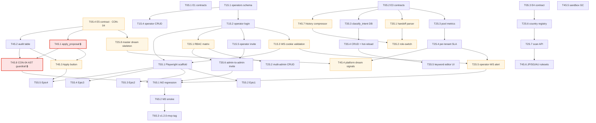

# M3 Task List · Human-Readable View

**Generated**: 2026-04-21 · [prd2impl:skill-3-task-gen]
**Source**: `docs/plans/m3/tasks.yaml` (authoritative)
**Scope**: 16 in-scope stories (Epic E2 DEFERRED_M4 per [PRD §8.1 Errata](../../prd/AutoService-M3-PRD.md))

---

## Summary

| Metric | Value |
|---|---|
| Total tasks | **39** |
| Green | 26 (67%) |
| Yellow | 13 (33%) |
| Red | **0** |
| Critical path length | 8 tasks |
| Estimated duration | **11.5 days serial / 7-9 days with P2 parallelism** |
| Phases | P0 → P1 → P2 → P3 → P4 → P5 → P6 |
| Playwright (P5) deferrable to M3.5 per CON-13 | Yes |

## Default OQ Values Applied (all overridable before kickoff)

| Epic | OQ | Default |
|---|---|---|
| E1-1 | admin cookie | keep `auth_session` (not rename) |
| E1-2 | session TTL / idle | 24h / 30min / logout drops WS |
| E1-3 | DB path | keep `auth.db` |
| E3-1 | per-tenant metrics in M3 | `pool_wait_ms` + `first_reply_ms` only |
| E3-2 | handoff reason | free-text |
| E3-3 | compression model | haiku (opt-in sonnet) |
| E4-1 | empty `countries[]` | fail-closed + warning |
| E4-2 | `region_filter` removal | M3 deprecate, M4 remove |
| E4-3 | M3 new countries | JP / SG / AU (~11 rules) |
| E5-1 | apply handler | `mark_applied` only (audit-first) |
| E5-2 | audit retention | indefinite |
| E5-3 | platform-config mutation owner | defer to M4+ |
| E6-1 | archive purge | permanent |
| E6-2 | Playwright browsers | chromium only |

---

## Phase Overview

| Phase | Batch | Tasks | Est Days | Gate |
|---|---|---|---|---|
| **P0** Contract Freeze | B-M3-0 | 4 | 1 | 4 contract docs reviewed |
| **P1** E1 P0 Foundation | B-M3-1 | 5 | 2 | Operator login/CRUD/invite e2e green |
| **P2** E1 P1 + parallel greens | B-M3-2 | 8 | 2 | RBAC + SLA metrics + country filter + master dream skeleton |
| **P3** E3 tail + E1 close | B-M3-3 | 6 | 2 | Handoff + classify_intent hot-reload + admin invite |
| **P4** E5/E6/E4/E3 remainders | B-M3-4 | 8 | 2 | apply_proposal security review + GC + new rulesets + compression |
| **P5** Playwright E2E | B-M3-5 | 5 | 2 | 17-story suite green (OR defer M3.5) |
| **P6** M3 Gate | B-M3-gate | 3 | 0.5 | M2 regression + M3 smoke + v1.2.0-mvp tag |

Total: **39 tasks over ~11.5 days** (7-9 with aggressive P2 parallelism).

---

## Task Table

### P0: Contract Freeze (4 tasks)

| ID | Name | Type | Effort | Depends |
|---|---|---|---|---|
| T0S.1 | E1 contracts: auth cookie + session + RBAC matrix | 🟢 | S | — |
| T0S.2 | E3 contracts: SLA metrics + handoff + classify_intent DB | 🟢 | S | — |
| T0S.3 | E4 contract: country registry + tenant.countries | 🟢 | S | — |
| T0S.4 | E5 contract: apply_proposal + audit + CON-04 guardrails | 🟡 | S | — |

### P1: E1 P0 Foundation (5 tasks)

| ID | Name | Type | Effort | Depends |
|---|---|---|---|---|
| T1S.1 | SQLite operators + operator_sessions tables | 🟢 | M | T0S.1 |
| T1S.2 | Operator HTTP login + operator_session cookie | 🟢 | M | T1S.1 |
| T1S.3 | WS handshake cookie validation (fixes [web_gateway.py:480-485](../../../autoservice/web_gateway.py#L480-L485) spoof gap) | 🟡 | M | T1S.2 |
| T1S.4 | Per-tenant operator CRUD API | 🟢 | S | T1S.1 |
| T1S.5 | Operator invite (magic-link role extension) | 🟢 | M | T1S.2 |

### P2: E1 P1 + parallel greens (8 tasks — highest fan-out)

| ID | Name | Type | Effort | Depends |
|---|---|---|---|---|
| T2S.1 | RBAC permission matrix + decorator (P95<5ms) | 🟡 | M | T1S.2 |
| T2S.2 | Multi-admin per tenant CRUD (E1.5) | 🟢 | S | T2S.1 |
| T2S.3 | Pool metrics emission on AsyncPool | 🟢 | S | T0S.2 |
| T2S.4 | Per-tenant SLA thresholds + pool_wait_ms wiring | 🟢 | M | T2S.3 |
| T2S.5 | Operator-WS alert push path | 🟡 | S | T2S.4, T1S.3 |
| T2S.6 | Country registry + tenant.countries validator | 🟢 | S | T0S.3 |
| T2S.7 | scan(countries=list) + deprecate region_filter | 🟢 | S | T2S.6 |
| T2S.8 | Master dream agent skeleton + scheduler routing | 🟡 | M | T0S.4 |

### P3: E3 tail + E1 close (6 tasks)

| ID | Name | Type | Effort | Depends |
|---|---|---|---|---|
| T3S.1 | `<handoff>` tag parser (mirror parse_sentiment) | 🟡 | S | T0S.2 |
| T3S.2 | Re-triage + role-switch orchestrator | 🟡 | M | T3S.1, T4S.7 |
| T3S.3 | classify_intent DB table + YAML migration | 🟢 | M | T0S.2 |
| T3S.4 | classify_intent CRUD + hot-reload (reuse clear_tenant_cache) | 🟢 | M | T3S.3 |
| T3S.5 | Admin-portal keyword editor extension (CON-10) | 🟢 | M | T3S.4 |
| T3S.6 | E1.6 admin-to-admin invite | 🟢 | S | T2S.1, T1S.5 |

### P4: E5/E6/E4/E3 remainders (8 tasks)

| ID | Name | Type | Effort | Depends |
|---|---|---|---|---|
| T4S.1 | **apply_proposal module** 🔒 CON-04 SECURITY-CRITICAL | 🟡 | M | T0S.4 |
| T4S.2 | proposal_audit table + state machine extension | 🟢 | S | T0S.4 |
| T4S.3 | Admin-portal Apply button + endpoint | 🟡 | S | T4S.1, T4S.2 |
| T4S.4 | Platform dream cross-tenant signal ingestion | 🟡 | M | T2S.8, T2S.4 |
| T4S.5 | sandbox_gc.py background job + 30d TTL | 🟢 | M | — |
| T4S.6 | JP/SG/AU compliance rulesets (~11 rules) | 🟢 | S | T2S.7 |
| T4S.7 | History compression service (haiku default) | 🟡 | M | T0S.2 |
| T4S.8 | **CON-04 AST guardrail test** 🔒 | 🟡 | S | T4S.1, T4S.2 |

### P5: Playwright E2E (5 tasks; may defer to M3.5)

| ID | Name | Type | Effort | Depends |
|---|---|---|---|---|
| T5S.1 | Playwright scaffold + config + CI (chromium) | 🟢 | M | T1S.2, T1S.3 |
| T5S.2 | Epic1 Onboarding suite (US-1.1–1.4) | 🟢 | M | T5S.1 |
| T5S.3 | Epic2 Realtime-chat suite (US-2.1–2.6) | 🟢 | L | T5S.1 |
| T5S.4 | Epic3 Dashboards suite (US-3.1–3.3) | 🟢 | M | T5S.1 |
| T5S.5 | Epic4 Dream-learning suite (US-4.1–4.4) | 🟢 | M | T5S.1, T4S.3 |

### P6: M3 Gate (3 tasks)

| ID | Name | Type | Effort | Depends |
|---|---|---|---|---|
| T6S.1 | M2 regression run (NFR-04) | 🟢 | S | T3S.6, T4S.8, T2S.5 |
| T6S.2 | M3 smoke test + evidence | 🟢 | M | T6S.1 |
| T6S.3 | M3 gate + tag v1.2.0-mvp | 🟢 | S | T6S.2 |

---

## Dependency Graph (Mermaid)



---

## Critical Path

```
T0S.1 → T1S.1 → T1S.2 → T2S.1 → T3S.6 → T6S.1 → T6S.2 → T6S.3
  (contract → schema → login → RBAC → admin invite → regression → smoke → tag)
```

**Length**: 8 tasks · **duration**: ~7 days (serial minimum; parallel fan-out absorbs most P2/P3/P4 tasks off the critical path).

---

## Warnings

- ⚠️ **T4S.1 apply_proposal** (🔒 CON-04 security-critical) — Yellow tier with **mandatory** `superpowers:code-reviewer` subagent pass before close
- ⚠️ **T3S.2 → T4S.7 cross-phase dep** — role-switch re-seed needs compression; consider pulling T4S.7 forward if timeline pressure
- ⚠️ **T5S.1–5 Playwright (P5)** — may defer to M3.5 per CON-13; does NOT block M3 gate
- ✅ **No Red-tier tasks** after E2 descope (was 2 under original E2.4 nested emplace)
- ✅ **Solo dev line (Dev1)**: parallelism via Claude Code subagents; **P2 has highest parallel fan-out (8 tasks)**

---

## Next Step

`/prd2impl:skill-4-plan-schedule --plans-dir docs/plans/m3` to produce batch timeline + parallelism plan.
